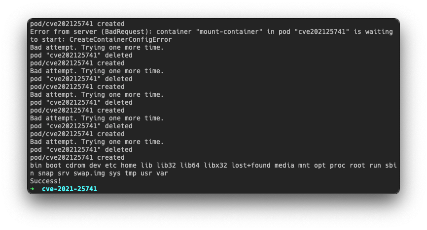
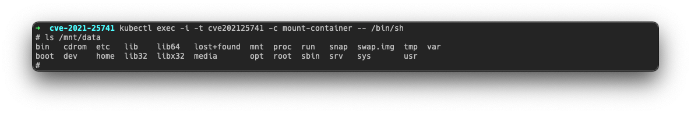

## About

It's exploit for CVE-2021-25741 vulnerability.
This vulnerability allows to mount Node filesystem inside of new POD with read-write privileges. 

You can read more about the vulnerability here: 

https://security.googleblog.com/2021/12/exploring-container-security-storage.html

I'm not author of this vulnerability and just made an exploit. 

Thanks to [@russtone](https://github.com/russtone) and [@maximusfox](https://github.com/maximusfox) for the help with development of the exploit. 

### Conditions

1. **You have privileges to create new PODs**
2. **Nodes have vulnerable kubelet**

Vulnerable versions of the kubelet: 
- v1.22.0 - v1.22.1
- v1.21.0 - v1.21.4
- v1.20.0 - v1.20.10
- <= v1.19.14

## How to use 

Just run run.sh and wait :) Exploiting will take some time (for me it was 10-20 minutes) because it's based on the race condition. 

```
chmod +x run.sh; ./run.sh
```



When you get message "Success" you can attach to the POD and find Node filesystem in `/mnt/data` directory.
For attaching you can use next command:

```
kubectl exec -i -t cve202125741 -c mount-container -- /bin/sh
```



## Technical Details

Exploit has 2 parts:

 - **pod.yaml**
	> YAML file with pod configuration that exploits vulnerability. Because of race conidition it doesn't work every time, so you should do it in a loop.
 - **run.sh**
 	> Scripts that deploys pod.yaml, checks result and re-deploy it if it's required. 

As renameat2 binary with RENAME_EXCHANGE option I used this code: https://gist.github.com/eatnumber1/f97ac7dad7b1f5a9721f

You can compile it by yourself and replace in `pod.yaml` if you want:

```
gcc renameat2.c -o renameat2
base64 renameat2
```

## Troubleshooting 

### I don't have kubectl in a system

Solutions:
 1. Just download it from official website and push to your system
 2. If it's not possible then you need to rewrite run.sh and send HTTP requests directly to Kubernetes API without using of kubectl

 ### I don't have privileges to run /bin/sh on the POD

 Solutions:
 1. You can try to bind /bin/sh to TCP Port and connect to this port. 
 2. You can edit pod.yaml and add required commands. It will be executed in the deploy process.
